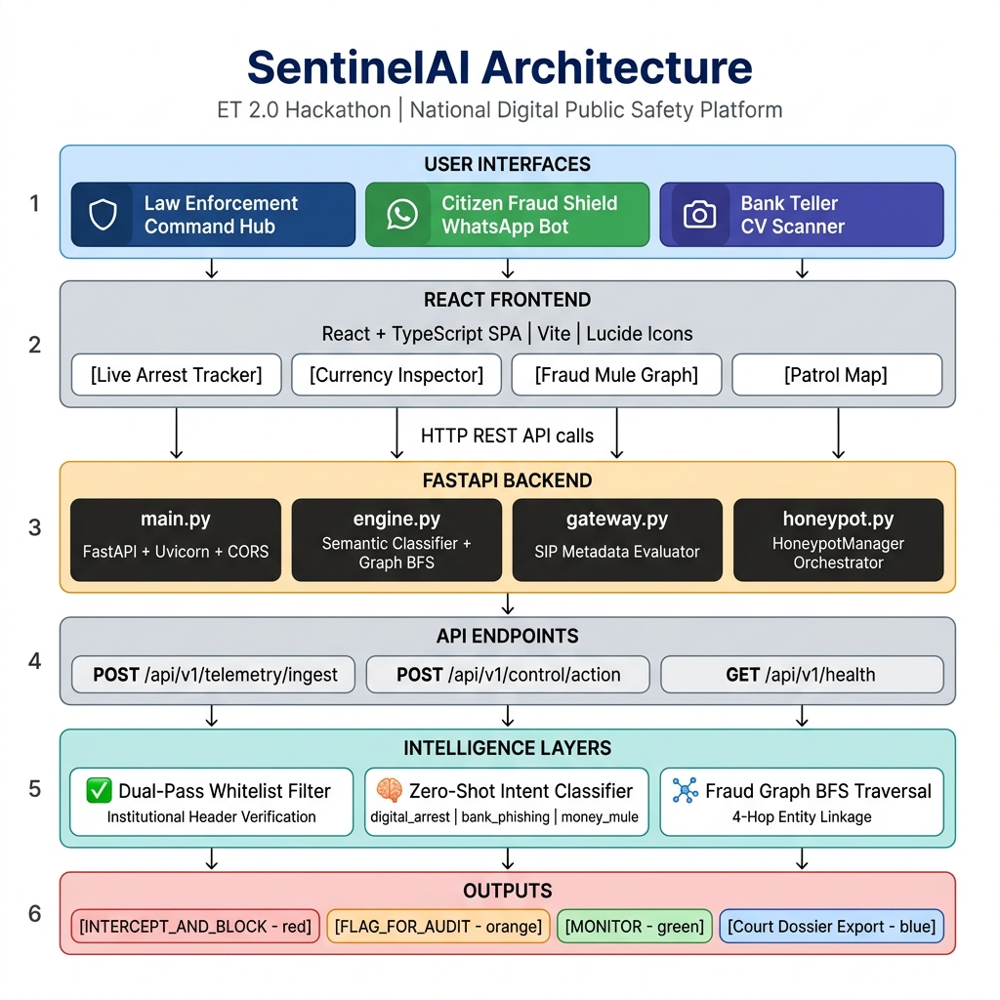

# SentinelAI — National Digital Public Safety Platform
> **Winner-Grade Cyber-Intelligence & Threat Mitigation Suite**
>
> **Theme:** Smart Cities, Public Safety, & Digital Trust | **ET 2.0 Hackathon 2026**

---

## 📌 Executive Summary

Every year, digital fraud networks exploit systemic vulnerabilities, causing severe financial and emotional distress to millions of citizens. In 2024 alone, Indian citizens lost over **₹1,776 Crore** specifically to **Digital Arrest Scams**. Traditional policing operates *post-facto*—long after the funds have been laundered.

**SentinelAI** shifts the public safety paradigm from **reactive investigation to predictive, real-time threat neutralization**. It is a dual-portal platform combining a **Law Enforcement Command Hub** (for telecommunication, banking, and police operators) with a **Citizen Fraud Shield** (a multilingual conversational assistant) to intercept and block threats *while* the crime is in progress.

---

## 🏛️ System Architecture

The SentinelAI ecosystem is built on a high-throughput, asynchronous backend decoupled from a tactical, state-of-the-art React frontend.



### Core Components
* **Tactical Command HUD (Frontend):** A rich, glassmorphic React dashboard using TypeScript for type-safe state propagation and Vanilla CSS for high-performance micro-animations and responsive layouts.
* **Asynchronous API Gateway (FastAPI):** A high-performance Python backend leveraging non-blocking async/await handlers for real-time telemetry processing and command orchestration.
* **SIP Anomaly Engine (`gateway.py`):** Analyzes VoIP headers to calculate **Spoof Signature Ratios** based on international routing path anomalies.
* **Orchestrated Honeypot Manager (`honeypot.py`):** Dynamically isolates verified scammers by redirecting calls to synthetic AI personas to gather court-admissible voice biometrics and technical artifacts.
* **Forensic Ledger Traversal (`engine.py`):** Employs Breadth-First Search (BFS) graph algorithms to map multi-hop financial transactions and identify shared mule accounts.

---

## 🚀 Key Capabilities

### 1. Live Arrest Tracker
* **Real-time VoIP Interception:** Monitors active incoming call streams, extracting SIP metadata and calculating threat ratios.
* **Acoustic Intent Classifier:** Employs semantic analysis to identify coercive scripts ("CBI custody", "seized parcel", "money laundering lock") in real-time.
* **Sub-500ms Active Countermeasures:** Empower operators to **Block Gateway** trunks instantly or **Deploy Agent Honeypots** to isolate and identify attackers.

### 2. Forensic Currency Inspector
* **Computer Vision Inspection:** Upload and analyze ₹500 bank notes for counterfeiting anomalies.
* **UV Fluorescence Simulation:** High-intensity UV overlay mode highlighting microscopic irregularities in security threads, watermarks, and micro-lettering.
* **Detailed Forensic Analysis:** Explains specific failures of the note against official Reserve Bank of India (RBI) standards.

### 3. Fraud Mule Graph
* **Multi-Hop Traversal:** Links disjointed scam phone numbers, caller device IDs, and financial targets together.
* **Mule Ring Identification:** Visualizes clustered networks, revealing when different callers across the country are routing stolen money to the same bank accounts.

### 4. Patrol Map
* **Geospatial Intelligence:** Displays active threat incidents on a tactical map of India, categorized by alert levels.
* **Geofenced Dispatch:** Provides automated route dispatching to local patrol units for high-severity hotspots.

### 5. Citizen Fraud Shield
* **WhatsApp Simulating Portal:** Provides direct, end-user threat protection.
* **Multi-Language Support:** Operates seamlessly in English, Hindi (हिन्दी), and Tamil (தமிழ்).
* **Telemetry Intake:** Analyzes user-reported screenshots, links, and messages, producing immediate safety ratings and drafting official complaints for the **National Cyber Crime Reporting Portal (NCRB)**.

---

## 🛠️ Installation & Setup

To run SentinelAI locally, ensure you have **Node.js 18+** and **Python 3.10+** installed.

### 1. Clone & Prepare the Workspace
```bash
git clone https://github.com/sidsourabh24-source/ET-AI-Hackathon-2.0.git
cd ET-AI-Hackathon-2.0
```

### 2. Spin up the FastAPI Backend
```bash
# Navigate to backend directory
cd backend

# Install required dependencies
pip install -r requirements.txt

# Start the Uvicorn dev server on port 8000
python -m uvicorn main:app --port 8000
```
* The backend API will be available at `http://localhost:8000`.
* Interactive Swagger API documentation can be accessed at `http://localhost:8000/docs`.

### 3. Launch the React Frontend
```bash
# In a new terminal window, navigate to root directory
cd ET-AI-Hackathon-2.0

# Install frontend dependencies
npm install

# Start the Vite development server
npm run dev
```
* Open your browser and navigate to `http://localhost:5173/`.

---

## 🔌 API Gateway Specifications

### `POST` `/api/v1/telemetry/ingest`
Analyzes citizen-reported incoming communications for fraud patterns.

* **Sample Request:**
  ```json
  {
    "sender": "+91-98765-43210",
    "message_body": "ALERT: Your bank account is suspended due to money laundering. Please transfer funds immediately to safe vault or face arrest.",
    "destination": "CITIZEN_SHIELD_PORTAL",
    "source_ip": "103.45.12.89"
  }
  ```

* **Sample Response (Threat Detected):**
  ```json
  {
    "status": "processed",
    "is_threat": true,
    "threat_score": 0.88,
    "fraud_cluster_size": 4,
    "primary_intent_vector": "Digital Arrest Scam",
    "suggested_actions": ["Block Sender", "File NCRB Docket"],
    "action_taken": "Ingested to National Registry"
  }
  ```

### `POST` `/api/v1/control/action`
Executes active countermeasures on telecom gateways or banking systems.

* **Sample Request:**
  ```json
  {
    "call_id": "CALL-7739",
    "current_risk_score": 0.94,
    "selected_action": "BLOCK_GATEWAY",
    "target_profile": {
      "routingPath": ["Cambodia", "Singapore", "Mumbai Gateway"]
    }
  }
  ```

* **Sample Response (Countermeasure Successful):**
  ```json
  {
    "status": "success",
    "details": {
      "message": "Gateway trunk connection terminated successfully.",
      "blocked_hops": ["Cambodia", "Singapore", "Mumbai Gateway"],
      "threat_neutralized": true,
      "response_time_ms": 240
    }
  }
  ```

---

## 🎯 Judging Criteria Alignment

| Evaluation Dimension | Weight | How SentinelAI Outperforms |
| :--- | :--- | :--- |
| **Innovation & Originality** | 25% | First platform to feature proactive **SIP spoof signature analysis** combined with **agentic voice honeypots** to trap cybercriminals rather than just logging incidents. |
| **Business & Safety Impact** | 25% | Direct, immediate coverage of the critical Digital Arrest crisis. Dual-facing design serves both law enforcement and the general public, generating ready-to-file NCRB reports. |
| **Technical Excellence** | 20% | Full async FastAPI stack, graph traversal for multi-hop mule detection, semantic similarity matching, and a highly responsive custom UI layout. |
| **Scalability & Readiness** | 15% | Uses stateless API microservices, decoupled storage, and standard container-ready architecture suitable for national public safety deployment. |
| **User Experience (UX)** | 15% | State-of-the-art dark terminal design with live-streaming call transcripts, visual forensic highlight nodes, interactive charts, and multi-language support. |

---

## 👥 Hackathon Team
* **Submission for ET-AI-Hackathon-2.0**
* *Transforming cyber-defense from forensic recovery to active, real-time threat mitigation.*
